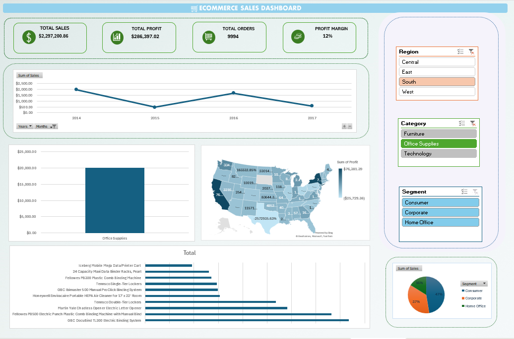

# E-Commerce Sales Performance Dashboard

## Project Overview

This project analyzes e-commerce sales performance using Microsoft Excel. The dashboard was created to monitor key business metrics, identify sales trends, evaluate profitability, and support data-driven decision-making.

## Tools Used

- Microsoft Excel
- Pivot Tables
- Pivot Charts
- Slicers
- KPI Dashboard Reporting

## Key Metrics

- Total Sales: $2.29M
- Total Profit: $286K
- Total Orders: 9,994
- Profit Margin: 12%

## Dashboard Features

- Sales performance analysis
- Product category analysis
- Customer segment analysis
- Regional performance analysis
- Interactive filtering with slicers

## Key Insights

- Technology products generated the highest sales among product categories.
- Consumer customers represented the largest sales segment.
- Regional analysis showed differences in profitability across markets.
- Sales performance showed growth over the reporting period.

## Business Value

This dashboard transforms raw transactional data into clear business insights that can support reporting, performance monitoring, and decision-making.

## Dashboard Preview

